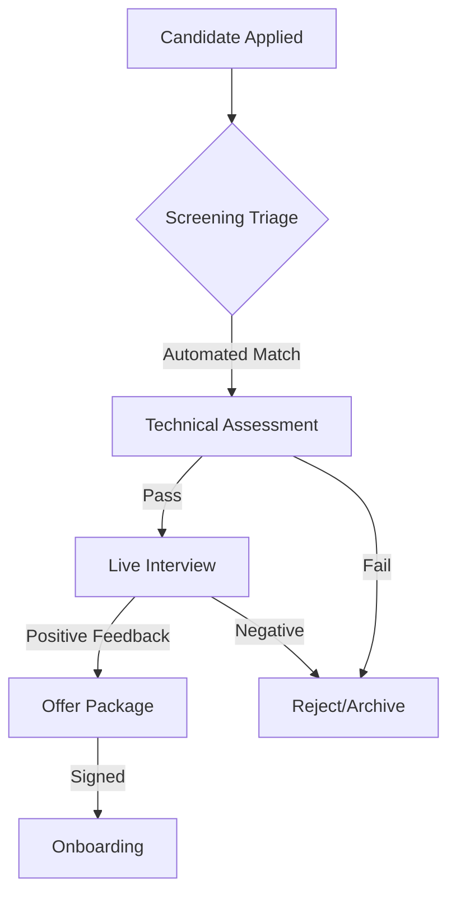

# AI-Driven Smart Recruitment & Interview Management System

> **Reference Platforms:** [HireVue](https://www.hirevue.com/) | [ModernHire](https://www.modernhire.com/)

An intelligent recruitment ecosystem designed to automate and optimize the technical hiring lifecycle. The platform moves beyond simple job boards by providing a structured, multi-stage evaluation workflow that connects HR departments with high-potential candidates.

---

## 🚀 Key Features

*   **Dynamic Skill-Weighting Engine**: Assign importance to specific skills and calculate a "Match Score." 
*   **Automated Technical Screening**: Intelligent triage to manage candidate transitions.
*   **Proctored Assessment Simulation**: Maintain integrity with focus-loss tracking and randomized questions.
*   **Multi-Dimensional Feedback**: Data-driven hiring decisions through aggregated feedback.

---

## 🧩 Core Modules

| Module | Description |
| :--- | :--- |
| **HR Admin** | Manages job requisitions, recruitment pipelines, and global platform settings. |
| **Technical Interviewer** | Tools for conducting live technical evaluations, scoring, and providing feedback. |
| **Candidate Portal** | Tracking applications, taking assessments, and managing professional profiles. |

---

## 🔄 Recruitment Lifecycle (Process Flow)

---

## 🛠️ Design Functions (42 Functions)

### A. Recruitment Pipeline & Triage
1.  **Automated Screening Triage**: Managing candidate transitions from Applied to Technical Test, Interview, and Offer.
2.  **Dynamic Skill-Weighting Engine**: Logic to calculate a "Match Score" relative to candidate profiles.
3.  **Job Requisition Approval Workflow**: Multi-tier logic gate for department head approval.
4.  **Application Deduplication Logic**: Identifying and merging duplicate candidate profiles.
5.  **AI-Ranked Shortlisting (Simulated)**: Algorithm ranking top 10% based on keywords and experience.
6.  **Pipeline Throughput Analytics**: Calculates "Time-to-Hire" and identifies bottlenecks.
7.  **External Job-Board Sync Manager**: Simulation of pushing job posts to multiple platforms.

### B. Assessment & Proctored Simulation
8.  **Proctored Environment Controller**: Tracks "Focus-Loss" events (e.g., switching tabs).
9.  **Randomized Question-Bank Generator**: Generates unique tests from different difficulty tiers.
10. **Timed-Session Heartbeat**: Automatically submits tests if the timer expires.
11. **Code-Execution Output Validator (Simulated)**: Compares output against hidden test cases.
12. **Plagiarism Detection Logic (Simulated)**: Compares responses against a "Common Answer" database.
13. **Dynamic Difficulty Adjustment**: Suggests harder/easier questions based on previous scores.
14. **Assessment "Cool-down" Manager**: Prevents retaking tests for a defined period (e.g., 6 months).

### C. Interviewer Coordination & Logistics
15. **Interviewer Availability Conflict Resolver**: Matches interviewer schedules with candidate availability.
16. **Multi-Representative Panel Builder**: Ensures balanced mix of Senior Technical and HR staff.
17. **Automated Interview Briefing Generator**: Compiling "Interviewer Packs" (resumes, scores, etc.).
18. **Live Coding Environment Sync**: Real-time code synchronization between interviewer and candidate.
19. **Interviewer "Shadowing" Logic**: Allows junior staff to observe without affecting scores.
20. **Session Extension Protocol**: Logic gate allowing extra time for technical issues.
21. **Interviewer Load Balancer**: Automatically assigns interviews based on staff workload.

### D. Feedback & Evaluation
22. **Multi-Dimensional Feedback Aggregator**: Compiles scores (Coding, Design, Culture) into one report.
23. **Score Normalization Algorithm**: Adjusts scores based on "Interviewer Harshness" trends.
24. **Candidate "Red-Flag" Escalation**: High-priority flags for ethical or serious concerns.
25. **Consensus Meeting Automator**: Triggers "Debrief Meeting" once all feedback is in.
26. **Post-Interview Sentiment Logger**: Tracking candidate "Experience Scores."
27. **Competency Gap Visualizer**: Spider-chart logic comparing actual vs. "Ideal Profile."
28. **Hiring Recommendation State-Machine**: Transitions from Evaluated to Strong Hire, Hire, etc.

### E. Offers & Onboarding
29. **Offer Package Calculator**: Calculates salary, bonuses, and stock options.
30. **Digital Offer-Letter Generator**: Populating legal templates with candidate data.
31. **Offer Validity Timer**: Automatically expires unsigned offers after a set window.
32. **Counter-Offer Negotiation Tracker**: Tracks revisions and approvals during negotiation.
33. **Referral Reward Attribution**: Identifies referrers and triggers bonuses.
34. **Background Check Integration (Simulated)**: Workflow for triggering and tracking external verification.
35. **Pre-Onboarding "Welcome" Portal**: Managing "Ready-for-Day-1" documents (ID, Tax, etc.).

### F. System Administration & Compliance
36. **Role-Based Access Control (RBAC)**: Managing granular permissions for HR and Interviewers.
37. **Data Retention & Privacy**: Anonymizing or deleting candidate data after a set period.
38. **Diversity & Inclusion Audit Reporter**: Generating reports on applicant diversity metrics.
39. **System Audit Trail**: Non-repudiable logs of every status and score modification.
40. **Template Versioning Manager**: Ensuring use of latest job descriptions and rubrics.
41. **Database Integrity Manager**: Archiving "Closed" requisitions and "Rejected" candidates.
42. **Automated Notification Escalator**: Sends reminders if feedback is missing after 24 hours.

---

### 🎓 Academic Context
*   **Institution**: Capital University [formerly Helwan University]
*   **Faculty**: Faculty of Computing & Artificial Intelligence | Computer Science Department
*   **Program**: Mainstream Programme
*   **Module**: CS251 Software Engineering 1 – Spring "Semester 2" 2025-2026